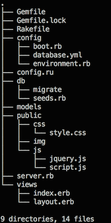
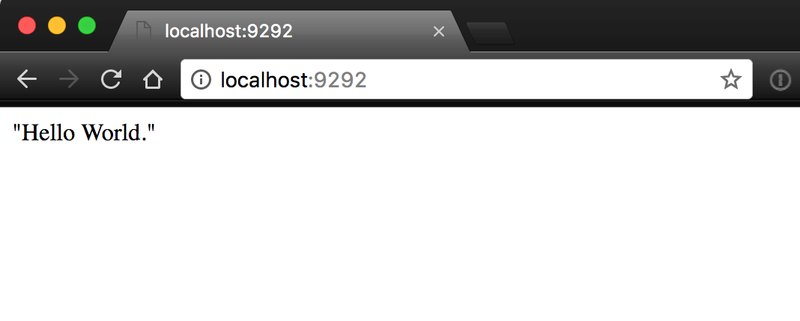
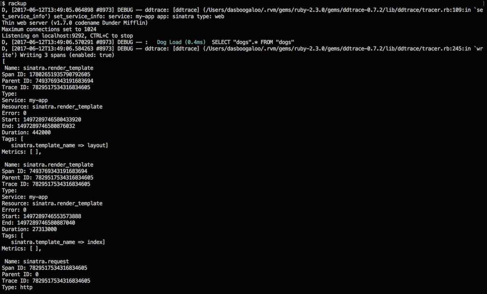
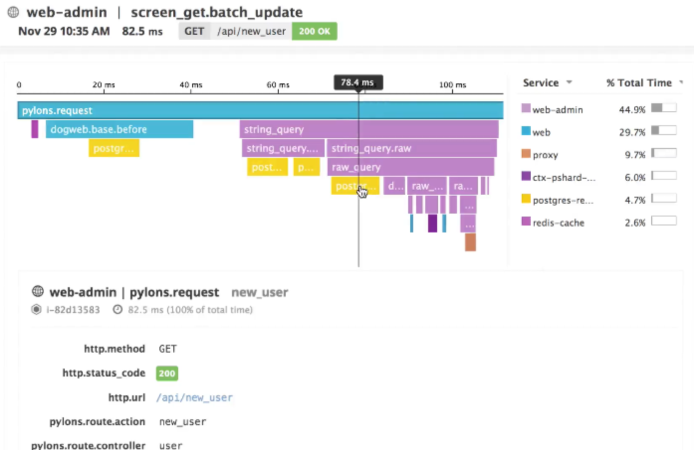

# Monitoring Sinatra Turntable with Datadog APM

**Sinatra Turntable** is a framework that allows you to spin up a full-stack web app in minutes, which integrates seamlessly with Datadog’s APM service for application performance monitoring.

APM allows you to trace requests and template rendering across a Sinatra app, so you can have a fuller picture of its health.


## Sinatra Turntable

Sinatra Turntable is a full-stack framework with two principal components:

- A **Sinatra** web server.
- A PostgreSQL database with an **ActiveRecord** wrapper.

[Sinatra](http://sinatrarb.com) is a minimalist web server written in Ruby that receives and inteprets HTTP requests, and renders HTML template views in response.

[ActiveRecord](http://guides.rubyonrails.org/active_record_basics.html) is an interface that allows you to interact with your database in Ruby, so you only need one language to work across your stack.

With a few commands, you can bootstrap a full web app with data-persistence.

## Installing Sinatra Turntable

To install Sinatra Turntable, open your bash profile (typically located in `~/.bash_profile`), [add this snippet](https://gist.github.com/schmartmann/7384d6e8a73657152778dc4d0936f28b), save, and reload your terminal.

## Running The Generator

To run the generator, enter `$ sinatra_turntable <your_apps_name>`.

**Example**:
`$ sinatra_turntable mans_best_friends`

The generator will create a directory structure, and populate it with the files needed to run your app.

It will prompt: `Would you like to set up ActiveRecord for this project? (y/n)`. If you don’t want ActiveRecord integration, simply reply `n`, and the generator will exit, leaving you with just a Sinatra app. Otherwise, reply `y`, and the generator will create the directories and files needed to integrate a database.

Once the generator finishes, you should see this file structure:



Test your app by running `$ rackup`. You should see the familiar Hello World! on http://localhost:9292.



## Setting Up Your Database

You can set up a database in four, short steps.

### Step 1: Creating the Database

Your database hasn’t actually been created yet, so run `$ rake db:create` to instantiate it.

**NOTE**: to list all rake commands, run `$ rake -T`.

### Step 2: Creating a Model File

ActiveRecord needs a model file to interact with your database tables. A model maps a table from our database to an object you can perform operations on.

Create a Ruby file in the `models` directory. The file name should correspond to the singular form of your database’s table’s name. For our example, you would create `dog.rb` inside the `models/` directory to correspond to a `dogs` table.

**models/dog.rb**:

```ruby
class Dog < ActiveRecord::Base
end
```

### Step 3: Creating a Migration File

Next, create a migration file to add your table to the database.

Run `$ rake db:create_migration NAME=<migration_name>`, and rake will automatically generate a migration file in `db/migrate`.

In the example, that command looks like this:
`rake db:create_migration NAME=add_dogs_table`

This generates a date-stamped migration file, within which you can define your table’s attributes.

The example migration file looks like this:

**db/migrate/20170608222332_add_dogs_table.rb**:
```ruby
class AddDogsTable < ActiveRecord::Migration
  def change
    create_table :dogs do |t|
      t.string :name
      t.string :breed
      t.integer :age
      t.boolean :is_good_boy
    end
  end
end
```
### Step 4: Running the Migration

Running `$ rake db:migrate`runs the migration file to make any additions or alternations to your database’s tables. 

Notice there is now a `schema.rb` file, that describes your tables, and lists the most recent migration's date.

In the example, the migration file creates a `dogs` table, and the `models/dog.rb` file connects it through the `Dog` object.

To pre-populate your database, add that data to `db/seeds.rb`, and run `$ rake db:seed` to seed it.

At this point, you should be able to access your database in `server.rb`, like so:

**server.rb**:
```ruby
get '/' do
  @dogs = Dog.all
  erb :index
end
```

## Enabling APM Tracing

Datadog's APM agent traces requests from request to response across your app. This metadata allows a top-level view of your app's health, and helps you understand how user requests effect your app's architecture.

To enable APM tracing, ensure you have a [Datadog account](https://www.datadoghq.com/), and install the [Datadog Agent](https://app.datadoghq.com/account/settings#agent). 

Next, add `gem ddtrace` to your Gemfile, and run `$ bundle install` to install the gem.

In `server.rb`, add these lines under `require 'sinatra/reloader'`: 
`require 'ddtrace'
require 'ddtrace/contrib/sinatra/tracer'`

Include this block underneath `configure :development do` to customize the tracer's configuration:
```ruby
configure do
  settings.datadog_tracer.configure default_service: 'my-app', debug: true
end
```

Finally, `$ rackup`, navigate to localhost:9292 in your browser, and you should see the tracer reporting data in your terminal.

Your tracer's terminal output will provde immediate feedback on requests flowing across your app:

(If you don't want this feedback, change `debug:true` to `false`.)


Your tracer gives you access to information such as:
  
  - Which templates are being rendered
  - Duration of rendering request 
  - HTTP request status codes

Your trace will be also visibile through the [Datadog web app](https://app.datadoghq.com/apm).


